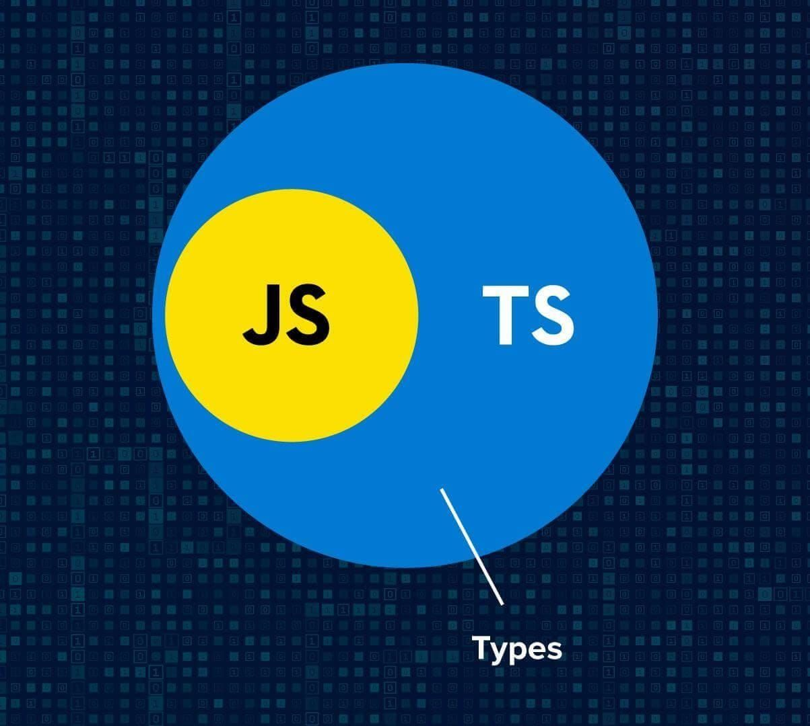

# Introduction
* ypeScript is a syntactic superset of JavaScript which adds static typing.
* TypeScript being a "Syntactic Superset" means that it shares the same base syntax as JavaScript, but adds something to it.
* TypeScript is JavaScript with added syntax for types.
* TypeScript builds on top of JavaScript. First, you write the TypeScript code. Then, you compile the TypeScript code into plain JavaScript code using a TypeScript compiler.
* TypeScript uses compile time type checking. Which means it checks if the specified types match before running the code, not while running the code.


**Why should I use TypeScript?**
* JavaScript is a loosely typed language. It can be difficult to understand what types of data are being passed around in JavaScript.

* In JavaScript, function parameters and variables don't have any information! So developers need to look at documentation, or guess based on the implementation.

* TypeScript allows specifying the types of data being passed around within the code, and has the ability to report errors when the types don't match.




Why TypeScript
The main goals of TypeScript are:

Introduce optional types to JavaScript.
Implement planned features of future JavaScript, a.k.a. ECMAScript Next or ES Next to the current JavaScript.
1) TypeScript improves your productivity while helping avoid bugs
* Types increase productivity by helping you avoid many mistakes. By using types, you can catch bugs at the compile time instead of having them occur at runtime.
* the TypeScript compiler will issue an error if you compile the TypeScript code into JavaScript. Hence, you can prevent the error from happening at runtime.

1) TypeScript brings the future JavaScript to today
* TypeScript supports the upcoming features planned in the ES Next for the current JavaScript engines. It means you can use the new JavaScript features before web browsers (or other environments) fully support them.

* Every year, TC39 releases several new features for ECMAScript, which is the standard of JavaScript. The feature proposals typically go through five stages:

* Stage 0: Strawperson
Stage 1: Proposal
Stage 2: Draft
Stage 3: Candidate
Stage 4: Finished
And TypeScript generally supports features that are in stage 3.

**Summary**
1) TypeScript is a superset of JavaScript.
2) TypeScript adds type to the JavaScript and helps you avoid potential bugs that occur at runtime.
3) TypeScript also implements the future features of JavaScript.

**Install Typescript**
```
npm install typescript --save-dev
```


**Check version Typescript**
```
tsc -v
```

**Compile Typescript Code**
```
tsc file_name.ts
```

**Auto Compile Typescript**
```
tsc file_name.ts --watch
```


